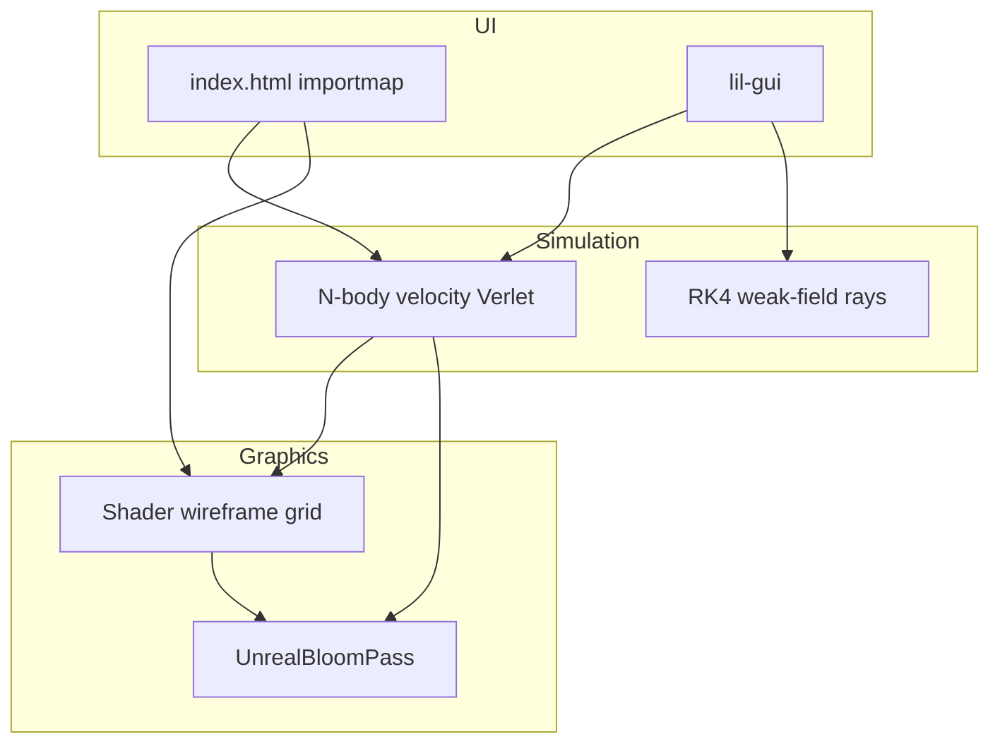

# Implementation notes

**Project:** [Gavity_sim](https://github.com/v3gaS/Gavity_sim) — browser N-body + schematic spacetime sheet + weak-field rays.

This file is aimed at **developers** who maintain or extend the codebase. End users should start with [README.md](README.md).

---

## Architecture

---

## Files

| File | Role |
|------|------|
| [`index.html`](index.html) | Import map for `three@0.170.0`, layout, education overlay |
| [`js/simulator.js`](js/simulator.js) | Scene, controls, composer, N-body, rays, trails, GUI |
| [`js/physics_constants.js`](js/physics_constants.js) | `GM_SI`, preset factories, GW150914 illustrative constants |

---

## N-body integrator

Each body carries position **r**, velocity **v**, and gravitational parameter **μ = GM** (same units as used in the force law).

**Acceleration** (softened point-mass field):

\[
\mathbf{a}_i = \sum_{j \neq i} \mu_j \frac{\mathbf{r}_j - \mathbf{r}_i}{\left( \|\mathbf{r}_j - \mathbf{r}_i\|^2 + \varepsilon^2 \right)^{3/2}}
\]

**Velocity Verlet** (substepped with user **Δt** and **substeps**):

1. \(\mathbf{v} \leftarrow \mathbf{v} + \tfrac{1}{2}\mathbf{a}\,\Delta t\)
2. \(\mathbf{r} \leftarrow \mathbf{r} + \mathbf{v}\,\Delta t\)
3. recompute \(\mathbf{a}\)
4. \(\mathbf{v} \leftarrow \mathbf{v} + \tfrac{1}{2}\mathbf{a}\,\Delta t\)

**Energy** (for drift monitoring; uses **μ** consistently with the acceleration above):

\[
E = \sum_i \tfrac{1}{2}\mu_i \|\mathbf{v}_i\|^2 - \sum_{i<j} \frac{\mu_i \mu_j}{\sqrt{\|\mathbf{r}_i-\mathbf{r}_j\|^2 + \varepsilon^2}}
\]

On preset load and when starting integration, a **baseline** energy is stored; the HUD shows fractional drift.

---

## Presets and scaling

- **Toy three-body**: positions and velocities in scene units; **μ = mass × 0.55** (`TOY_MU_SCALE` in [`simulator.js`](js/simulator.js)).
- **DE440-based presets** (Earth–Moon, Sun–Jupiter, GW toy): built in **dimensionless** coordinates with \(\sum \mu' = 1\) and separation 1, then mapped to the scene by a factor **S** (`separationScene`):

  - \(\mu_i^{\mathrm{scene}} = \mu_i' \, S^3\)
  - \(\mathbf{r}^{\mathrm{scene}} = S \mathbf{r}'\), \(\mathbf{v}^{\mathrm{scene}} = S \mathbf{v}'\)

This keeps Keplerian timing consistent when the orbit is rescaled to fit the grid.

---

## Rubber sheet (GPU)

[`gridVertexShader`](js/simulator.js) displaces each vertex in **+Y** by a sum of **−k μ / r²** terms (same inverse-square family as the old CPU demo, with clamp). [`gridFragmentShader`](js/simulator.js) tints by a crude **potential** proxy. This remains a **metaphor**, not a numerical GR embedding.

Uniforms pack up to **8** bodies as `vec4(x, y, z, μ)`.

---

## Light rays

**Weak-field mode**: approximate bending using the **gradient of the Newtonian potential** generated by all masses (evaluation height **y ≈ 0.55** for the ray plane). State \((p_x, p_z, k_x, k_z)\) with affine step **dl**:

- \(\mathrm{d}\mathbf{p}/\mathrm{d}\lambda = \mathbf{k}\)
- \(\mathrm{d}\mathbf{k}/\mathrm{d}\lambda = -s \,\nabla \Phi\) with user gain **s** (`rayBend`)

**Compact lens mode**: only the **dominant-μ** body contributes to \(\nabla \Phi\), and the deflection term is multiplied by **2** (educational link to light deflection vs Newtonian).

Integration: **RK4** per step, then **renormalize** \(\mathbf{k}\) to unit length in the **xz** plane.

---

## Post-processing

- [`EffectComposer`](https://threejs.org/docs/#examples/en/postprocessing/EffectComposer) + [`RenderPass`](https://threejs.org/docs/#examples/en/postprocessing/RenderPass) + [`UnrealBloomPass`](https://threejs.org/docs/#examples/en/postprocessing/UnrealBloomPass)
- Renderer: `ACESFilmicToneMapping`, `SRGBColorSpace`

---

## Performance

- **High-res grid**: 56×56 segments (wireframe); **low-res**: 28×28.
- Light paths: 24 rays × up to 140 segments, rebuilt when masses move (only while paths are visible).

---

## Browser requirements

- WebGL 2–capable browser.
- **HTTP(S) server** required (ES modules + local imports); see [README.md](README.md).

---

## Repository

Source and issues: **https://github.com/v3gaS/Gavity_sim**
